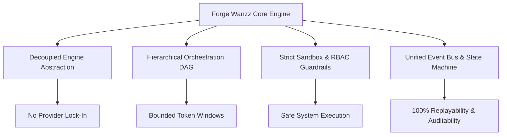

# 00 — PRODUCT THESIS: FORGE WANZZ (v0.1)

> **Document Version:** 0.1.0  
> **Status:** Approved / Foundation  
> **Target System:** Forge Wanzz Autonomous Multi-Agent Execution Engine  
> **Classification:** Core Technical & Product Strategy

---

## 1. Executive Summary

**Forge Wanzz** is an enterprise-grade, extensible, autonomous multi-agent operating framework and runtime engine. It bridges the gap between raw Large Language Models (LLMs) and reliable production execution by transforming probabilistic AI models into deterministic, goal-driven, and verifiable workflow actors.

Traditional agent platforms suffer from prompt-drift, untracked execution state, brittle tool calling, and high token attrition. **Forge Wanzz 0.1** introduces a modular micro-kernel runtime architecture built around discrete skills, strict capability sandboxing, dynamic multi-provider routing, and hierarchical agent orchestration.

---

## 2. The Core Problem Statement

### 2.1 The AI Agency Paradox
1. **Unpredictable Trajectories:** Autonomous agents often hallucinate non-existent tools, loop infinitely, or derail from initial user goals without human-in-the-loop intervention.
2. **Context Window Pollution:** Passing massive raw outputs, full system logs, and uncurated conversational context degrades reasoning efficiency and inflates API costs exponentially.
3. **Vendor Lock-In & Brittle Integrations:** Hardcoded dependencies on single model providers (e.g. OpenAI only, Anthropic only) create availability vulnerabilities and block cost-performance tiering.
4. **Environment Isolation Deficits:** Executing arbitrary agent code or shell commands without granular role-based access controls (RBAC) and OS-level sandboxing introduces critical enterprise security risks.

---

## 3. The Forge Wanzz Thesis

```
Deterministic Orchestration + Dynamic Skill Discovery + Sandboxed Execution = Enterprise-Reliable Autonomy
```

We posit that LLMs should function purely as **computational reasoning cores** (inference engines) within a rigorously typed, state-machine-controlled host harness. Forge Wanzz decouples:
- **Thinking** (Provider Router & Planning Topology) from
- **Capability** (Skill Engine & Tool Execution) from
- **State & Memory** (Memory Context Engine & Event Bus) from
- **Supervision** (Task Engine, RBAC, & Audit Telemetry).

---

## 4. Key Value Propositions

| Pillar | Value Proposition | Impact |
| :--- | :--- | :--- |
| **Micro-Kernel Modularity** | Lightweight core runtime with pluggable provider, skill, and storage adapters. | Zero framework bloat, sub-50ms boot overhead. |
| **Progressive Skill Disclosure** | Metadata-only schema exposure until tool invocation is explicitly requested. | Up to 70% token savings on tool registration. |
| **Multi-Tier Provider Routing** | Dynamic fallback & latency/cost-optimized model dispatching. | 99.99% uptime with up to 45% lower inference costs. |
| **Deterministic DAG Workflows** | Declarative task graphs with self-healing, retries, and human checkpoints. | Zero infinite runaway loops. |
| **Dual-Plane Interface** | Unified CLI for developers & reactive real-time Dashboard for operators. | Seamless dev-to-production lifecycle. |

---

## 5. Target Personas & Use Cases

### 5.1 Primary Personas
- **AI Systems Engineers:** Building complex multi-agent pipelines requiring granular observability, custom tools, and strict cost controls.
- **Enterprise Automation Teams:** Automating complex DevOps, data synthesis, and customer operations tasks safely.
- **Full-Stack Developers:** Requiring drop-in autonomous agents with ready-to-use CLI and web management consoles.

### 5.2 Core Use Cases
- **Autonomous Coding & Repo Refactoring:** Multi-agent code search, edit verification, and automated PR generation.
- **Complex Incident Response:** Automated log ingestion, triage, provider fallbacks, and remediation proposal.
- **Multi-Source Research & Synthesis:** Parallel agent swarms scraping, synthesizing, cross-checking facts, and compiling reports.

---

## 6. Strategic Differentiators



1. **Deterministic State Replayability:** Every event, prompt delta, tool payload, and agent transition is streamed to an append-only event ledger, enabling exact post-mortem replay.
2. **True Protocol Agnosticism:** Native support for local inference (Ollama, vLLM, Llama.cpp) and cloud APIs (OpenAI, Anthropic, Gemini, Groq, DeepSeek) through a unified interface.
3. **Enterprise Defense-in-Depth:** Zero untrusted execution. Tools run in ephemeral isolated containers or process sandboxes with strict syscall filters.

---

## 7. Success Criteria & North Star Metrics

- **Reliability:** Task completion rate $> 92\%$ on multi-step workflows without human intervention.
- **Latency:** Core engine overhead $< 15\text{ms}$ per dispatch step (excluding remote LLM generation time).
- **Cost Efficiency:** Minimum $35\%$ token expenditure reduction via progressive skill revelation vs. monolithic agent systems.
- **Developer Experience:** `< 5\text{ minutes}` from zero to a running multi-agent workflow via `forge init` and `forge run`.
