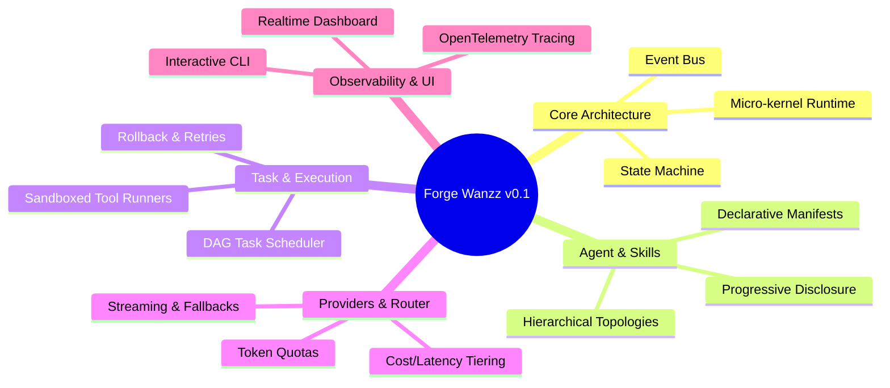

# 01 — MASTER PRODUCT REQUIREMENTS DOCUMENT (PRD)

> **Document Version:** 0.1.0  
> **Target Release:** Forge Wanzz v0.1 (MVP)  
> **Status:** Draft / Approved for Implementation  
> **Author:** Architecture & Core Systems Team

---

## 1. Product Overview & Vision

**Forge Wanzz v0.1** is an autonomous agent runtime and multi-agent coordination platform designed to plan, delegate, execute, and verify complex technical tasks. The framework empowers developers and enterprises to construct custom swarms of specialized agents that collaborate predictably, call tools securely, and dynamically optimize inference costs and latency.

### 1.1 Core Mission
To provide an unyielding, fault-tolerant execution backbone for AI agents that bridges high-level semantic reasoning with low-level deterministic system operations.

---

## 2. Target Personas

| Persona | Role | Primary Objectives | Pain Points Addressed |
| :--- | :--- | :--- | :--- |
| **DevOps & Platform Eng** | Infrastructure Lead | Automate system operations, incident resolution, cluster maintenance. | Risk of destructive shell execution, lack of auditability. |
| **AI Software Engineer** | Core Developer | Implement agentic workflows, custom skills, and domain RAG pipelines. | Complex state management, vendor lock-in, messy tool schemas. |
| **Tech Lead / Architect** | System Overseer | Monitor token burn, control agent safety boundaries, review traces. | Runaway API bills, opaque black-box agent loops. |

---

## 3. Goals and Non-Goals (Scope Boundary)

### 3.1 In Scope (v0.1)
- **Modular Micro-Kernel:** Core orchestrator coordinating tasks, agents, and tool execution.
- **Hierarchical Agent Topologies:** Supervisor $\rightarrow$ Worker $\rightarrow$ Evaluator patterns.
- **Skill Engine with Manifests:** Standardized `skill.yaml` specification with progressive disclosure.
- **Multi-Provider Router:** Plug-and-play support for OpenAI, Anthropic, Gemini, Groq, Ollama.
- **Sandboxed Tool Runtime:** Node.js/Python tool runners with timeouts, memory limits, and input validation.
- **Deterministic Task Engine:** Directed Acyclic Graph (DAG) task planner with retry policies and state rollback.
- **Dual-Plane Interfaces:** Rich Command-Line Interface (`forge-cli`) and real-time Web Dashboard (`forge-ui`).
- **Unified Event & Trace Stream:** Append-only log with OpenTelemetry-compatible event schema.

### 3.2 Non-Goals (Out of Scope for v0.1)
- Multi-region distributed Byzantine consensus among untrusted external nodes.
- Full autonomous code compilation inside hardware bare-metal without OS virtualization.
- Consumer-grade mobile native apps (iOS / Android).

---

## 4. High-Level System Features (Epics)

---

## 5. Functional Requirements Breakdown

### Epic 1: Agent Definition & Lifecycle (`FR-100`)
- **FR-101:** Support declarative agent specification via YAML/JSON (identity, system prompt, tool whitelist, provider policy).
- **FR-102:** Support distinct agent roles: `Planner`, `Executor`, `Evaluator`, `Critic`.
- **FR-103:** Implement deterministic state transitions: `IDLE` $\rightarrow$ `PLANNING` $\rightarrow$ `EXECUTING` $\rightarrow$ `AWAITING_APPROVAL` $\rightarrow$ `COMPLETED` $\rightarrow$ `FAILED`.

### Epic 2: Skill & Tool Framework (`FR-200`)
- **FR-201:** Progressive Skill Disclosure: Agents initially see only names and 1-line descriptions; full parameter schemas are injected only upon selection.
- **FR-202:** Dynamic Skill Discovery: Auto-discovery of custom skills located in `.forge/skills/` and global skill packages.
- **FR-203:** Type-safe parameters validation using JSONSchema / Zod before tool dispatch.

### Epic 3: Multi-Provider Routing & Optimization (`FR-300`)
- **FR-301:** Provider abstraction unifying streaming, token calculation, and function calling.
- **FR-302:** Rule-based routing based on task complexity (e.g. lightweight planning to Gemini Flash / Haiku; complex synthesis to Claude 3.5 Sonnet / GPT-4o).
- **FR-303:** Automated circuit-breaking and fallback on HTTP 429/500/503 errors.

### Epic 4: Task Scheduling & DAG Execution (`FR-400`)
- **FR-401:** Task decomposition into executable DAG nodes with explicit dependencies.
- **FR-402:** Parallel execution of independent DAG branches.
- **FR-403:** Dynamic re-planning if an evaluator agent marks a node execution invalid.

### Epic 5: Storage, Context & Memory (`FR-500`)
- **FR-501:** Dual-layer memory: Short-term working context (sliding window + auto-compaction) and Long-term semantic memory (vector embeddings).
- **FR-502:** Persistent task storage using SQLite (embedded) and PostgreSQL (production).

### Epic 6: Operator Interfaces (`FR-600`)
- **FR-601:** Interactive CLI (`forge run`, `forge status`, `forge skill list`, `forge config`).
- **FR-602:** Web Dashboard displaying live agent graphs, active task DAGs, token burn rates, and execution logs.

---

## 6. Non-Functional Requirements (NFRs)

### 6.1 Performance & Latency
- **NFR-01:** Engine internal orchestration overhead must not exceed 20ms per step.
- **NFR-02:** Local event bus throughput must support at least 5,000 events/second.

### 6.2 Security & Isolation
- **NFR-03:** Tool execution must occur in isolated subprocesses with configurable CPU (max 2 cores) and memory limits (max 512MB default).
- **NFR-04:** API credentials and secrets must be encrypted at rest using AES-256-GCM.

### 6.3 Reliability & Fault Tolerance
- **NFR-05:** In-flight tasks must persist state checkpoints to disk so operations can resume after system reboot or process crash.
- **NFR-06:** Graceful shutdown on `SIGINT`/`SIGTERM` with clean task suspension.

---

## 7. Acceptance Criteria & MVP Deliverables

1. Developers can run `forge init` to generate a functional workspace scaffolding.
2. A multi-agent workflow (Planner + Coder + Reviewer) can solve a non-trivial code generation and testing task autonomously.
3. If an upstream LLM times out or rate limits, the Provider Router automatically shifts to a configured fallback model without crashing the task.
4. All tool invocations require confirmation if marked with `danger: true` in the security policy.
5. The web dashboard visualizes the active DAG and real-time log events via WebSockets.
