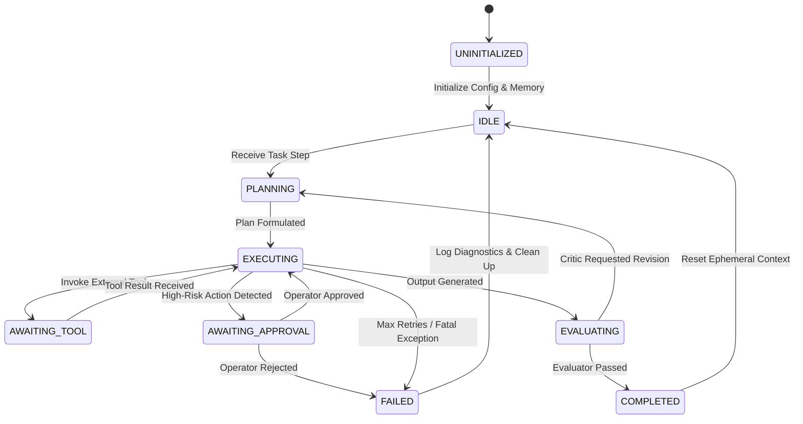

# 03 — AGENT SYSTEM SPECIFICATION

> **Document Version:** 0.1.0  
> **Status:** Approved Specification  
> **Component:** Core Agent Subsystem (`@forge/agent-system`)  
> **Classification:** Core Engine Architecture

---

## 1. Overview & Agent Philosophy

In Forge Wanzz, an **Agent** is not merely a single LLM prompt loop. It is an autonomous computational entity endowed with:
1. **Identity & Persona:** Explicit domain purpose, role boundaries, and linguistic behavior.
2. **Execution State Machine:** Predictable, observable lifecycle states.
3. **Restricted Capability Set:** A strict whitelist of skills/tools it is permitted to invoke.
4. **Context & Working Memory:** Scoped contextual awareness that isolates internal thought processes from parent or sibling agents.
5. **Provider Affinity:** Policy-driven binding to appropriate inference models (e.g. fast reasoning vs. deep synthesis).

---

## 2. Agent Manifest Specification (`agent.yaml`)

Every agent within Forge Wanzz is declared via a declarative schema.

```yaml
version: "0.1"
id: "agent.engineer.coder"
name: "Forge Code Synthesizer"
role: "Worker"
description: "Specialized in generating, editing, and verifying TypeScript and Python source code."

provider_policy:
  primary: "anthropic/claude-3-5-sonnet"
  fallback: "openai/gpt-4o"
  temperature: 0.1
  max_tokens: 4096
  timeout_ms: 30000

capabilities:
  skills:
    - "skill.filesystem"
    - "skill.git"
    - "skill.ast_analyzer"
  tools_blacklist:
    - "filesystem.delete_root"

memory:
  type: "hybrid" # working_buffer + vector_semantic
  context_window_limit: 64000
  compression_strategy: "summarize_sliding_window"

system_prompt: |
  You are an expert autonomous software engineer within the Forge Wanzz ecosystem.
  Your duties are strictly confined to generating correct, idiomatic, and lint-free code.
  Always inspect file contents before applying edits.
  Provide clean diffs and explain technical rationale concisely.
```

---

## 3. Agent Finite State Machine (FSM)



### State Definitions:
- **`IDLE`:** Ready to accept assigned tasks from the Orchestrator.
- **`PLANNING`:** Deconstructing assigned step into reasoning sequences and deciding tool requirements.
- **`EXECUTING`:** Generating tokens, parsing tool calls, and interacting with the provider router.
- **`AWAITING_TOOL`:** Paused while external tool runner completes sandboxed execution.
- **`AWAITING_APPROVAL`:** Paused awaiting human-in-the-loop or policy approval.
- **`EVALUATING`:** Self-checking or submitting output to an Evaluator agent.
- **`COMPLETED` / `FAILED`:** Terminal step states triggering event emission.

---

## 4. Agent Taxonomy & Roles

```
                      ┌───────────────────────┐
                      │   Supervisor Agent    │
                      │ (Planner & Delegator) │
                      └──────────┬────────────┘
                                 │
                 ┌───────────────┴───────────────┐
                 ▼                               ▼
       ┌───────────────────┐           ┌───────────────────┐
       │   Worker Agent    │           │   Worker Agent    │
       │ (Code Synthesizer)│           │ (Research Scout)  │
       └─────────┬─────────┘           └─────────┬─────────┘
                 │                               │
                 └───────────────┬───────────────┘
                                 ▼
                      ┌───────────────────────┐
                      │    Evaluator Agent    │
                      │ (Critic & Validator)  │
                      └───────────────────────┘
```

1. **Supervisor / Planner:** Interprets high-level user goals, breaks them down into task graphs, and monitors overall trajectory.
2. **Specialized Workers:** Domain specialists (e.g. Coder, Data Analyst, Shell Operator, Doc Writer). Workers do not re-plan the overall system goal.
3. **Evaluators / Critics:** Dedicated validation agents with zero tool-execution rights. They review diffs, test results, and factuality against strict criteria.
4. **Human Proxy:** Intermediary agent that translates system roadblocks into structured questions for human operators via CLI or UI.

---

## 5. Dynamic Prompt Composition Pipeline

Every agent turn constructs its final LLM prompt through a 5-layer pipeline:

```
┌───────────────────────────────────────────────────────────┐
│ Layer 1: Base Core System Directives (Kernel Invariants)   │
├───────────────────────────────────────────────────────────┤
│ Layer 2: Agent Persona & Role Constraints (agent.yaml)     │
├───────────────────────────────────────────────────────────┤
│ Layer 3: Progressive Skill Schemas (Active Tools Only)    │
├───────────────────────────────────────────────────────────┤
│ Layer 4: Semantic Memory Injections (Retrieved Context)   │
├───────────────────────────────────────────────────────────┤
│ Layer 5: Working Turn Buffer & Dynamic Scratchpad         │
└───────────────────────────────────────────────────────────┘
```

- **Token Budget Allocation:** Total token limit is partitioned predictably:
  - 15% System & Persona
  - 25% Tool Schemas & Documentation
  - 20% Semantic Knowledge Retrieval (RAG)
  - 40% Dynamic Turn History and Model Output Generation.

---

## 6. Communication & Context Isolation

- **No Cross-Contamination:** Agents do not share their internal conversational scratchpads directly with other agents.
- **Artifact-Based Handoff:** Agents exchange structured inputs/outputs (JSON contracts, Markdown artifacts, File diffs) rather than raw token histories.
- **Trace Correlation:** Every agent invocation inherits a `trace_id` and unique `span_id` allowing end-to-end visualization in the Dashboard.
