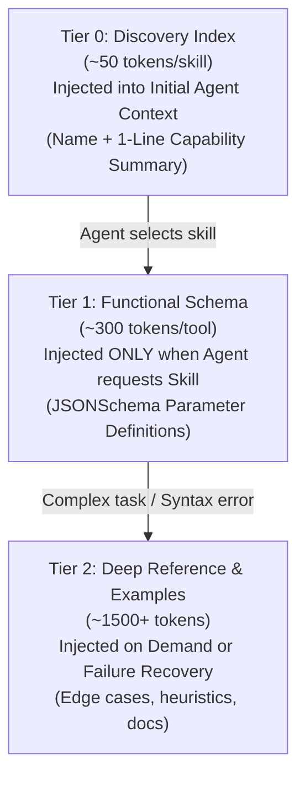
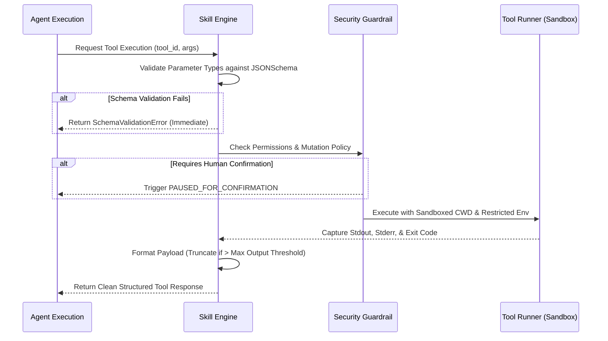

# 04 — SKILL ENGINE SPECIFICATION

> **Document Version:** 0.1.0  
> **Status:** Approved Specification  
> **Component:** Skill Discovery, Schema Registry, & Injection (`@forge/skill-engine`)  
> **Classification:** Core Engine Architecture

---

## 1. Concept: Skills vs. Tools

In Forge Wanzz, we make a deliberate distinction between **Skills** and **Tools**:

- **Tool:** An atomic, executable function with strongly-typed input/output JSON schemas (e.g., `read_file`, `exec_command`, `git_checkout`).
- **Skill:** A cohesive domain package comprising:
  1. Multiple related atomic tools.
  2. Operational instructions and best-practice system heuristics (`SKILL.md`).
  3. Pre-execution safety constraints and authorization policies.
  4. Local scripts or sandboxed runner modules.

---

## 2. Progressive Disclosure Architecture

To prevent context window exhaustion and prompt saturation, Forge Wanzz implements **3-Tier Progressive Skill Disclosure**:



### Benefits:
- **70% Token Savings:** An agent registered with 50 tools does not pass 50 complete schemas in every turn.
- **Hallucination Prevention:** Models focus on relevant function signatures instead of being overwhelmed with confusing parameter spaces.

---

## 3. Skill Manifest Specification (`skill.yaml`)

```yaml
version: "0.1"
id: "skill.git"
name: "Git Repository Manager"
version_semver: "1.0.0"
description: "Safe version control operations including clone, status, diff, branch, and commit."
author: "Forge Wanzz Core Team"

security:
  requires_approval_on_mutation: true
  allowed_working_directories:
    - "${WORKSPACE_ROOT}"
  forbidden_commands:
    - "push --force"
    - "reset --hard HEAD~50"

tools:
  - id: "git_status"
    name: "Get Repository Status"
    description: "Returns working tree status, modified files, and untracked files."
    execution:
      runner: "builtin/shell"
      command: "git status --porcelain=v1"
    parameters:
      type: "object"
      properties:
        short:
          type: "boolean"
          default: true
      required: []

  - id: "git_diff"
    name: "Get Git Diffs"
    description: "Inspects unstaged or staged diffs for specific files or entire workspace."
    execution:
      runner: "builtin/shell"
      command: "git diff ${args.path || ''}"
    parameters:
      type: "object"
      properties:
        path:
          type: "string"
          description: "Relative file path to diff. Leave empty for all modified files."
        staged:
          type: "boolean"
          default: false
      required: []
```

---

## 4. Skill Directory Hierarchy

```
.forge/skills/ (or global ~/.forge/skills/)
└── skill.git/
    ├── skill.yaml           # Machine-readable schema & tool definitions
    ├── SKILL.md             # Natural language instructions & agent guidance
    ├── scripts/             # Local helper scripts (Bash, Python, Node)
    │   └── git_helper.sh
    └── references/          # Deep documentation (Tier 2 progressive docs)
        └── merge_resolution.md
```

---

## 5. Skill Discovery & Resolution Order

When an agent requests a skill (`skill.git`), the Skill Engine resolves the definition through a 3-tier lookup cascade:

1. **Workspace Root:** `${WORKSPACE_ROOT}/.forge/skills/<skill-id>` *(Highest priority - allows project overrides)*
2. **User Global Config:** `~/.forge/skills/<skill-id>` *(User-wide shared skills)*
3. **Core Built-in Registry:** `@forge/skills/<skill-id>` *(Engine built-ins: filesystem, shell, http, memory)*

---

## 6. Skill Sandbox & Execution Pipeline



---

## 7. Dynamic Skill Composition

The Skill Engine supports **Composite Skills** (meta-skills). For example, a `skill.fullstack_tester` can automatically import and bundle:
- `skill.filesystem`
- `skill.docker`
- `skill.browser_automation`

This allows system architects to define clean domain bundles for specific agent personas without duplicate schema declarations.
