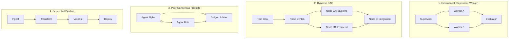

# 05 — ORCHESTRATION ENGINE SPECIFICATION

> **Document Version:** 0.1.0  
> **Status:** Approved Specification  
> **Component:** Multi-Agent Coordination & Topologies (`@forge/orchestration-engine`)  
> **Classification:** Core Engine Architecture

---

## 1. Overview & Core Mission

The **Orchestration Engine** in Forge Wanzz is responsible for high-level mission strategy, multi-agent coordination, dynamic dependency management, and consensus resolution. It ensures that complex, ambiguous user prompts are converted into orderly, fault-tolerant execution graphs.

---

## 2. Multi-Agent Topologies Supported

Forge Wanzz natively supports 4 discrete coordination patterns:



### Topology Descriptions:
1. **Hierarchical (Default):** A lead Planner agent decomposes tasks and delegates to domain-specialist workers, awaiting evaluator sign-off.
2. **Dynamic DAG:** The plan is treated as a directed acyclic graph where non-dependent nodes execute in parallel async workers.
3. **Peer Consensus / Debate:** Two or more agents independently generate solutions and critique each other; an Arbiter agent synthesizes the consensus.
4. **Sequential Pipeline:** Strict linear execution where step $N+1$ directly consumes output artifact from step $N$.

---

## 3. The Orchestration Lifecycle

```mermaid
sequenceDiagram
    autonumber
    participant User as Operator (CLI/UI)
    participant Orch as Orchestration Engine
    participant Planner as Supervisor / Planner
    participant Worker as Worker Swarm
    participant Critic as Evaluator / Critic

    User->>Orch: Start Mission: "Migrate DB to Postgres"
    Orch->>Planner: Formulate Execution Graph (DAG)
    Planner-->>Orch: Return Execution DAG with Dependency Edges
    
    rect rgb(30, 40, 60)
        note over Orch,Worker: Concurrent Branch Execution
        par Branch A
            Orch->>Worker: Task: Generate Prisma Schema
            Worker-->>Orch: Schema Artifact Created
        and Branch B
            Orch->>Worker: Task: Provision Test Database Container
            Worker-->>Orch: Container Healthy (Port 5432)
        end
    end

    Orch->>Critic: Submit Artifacts for Review
    alt Passed Quality Gate
        Critic-->>Orch: Approval Verified
        Orch->>User: Mission Completed Successfully
    else Failed Quality Gate
        Critic-->>Orch: Rejected (Syntax Errors Found in Migration)
        Orch->>Planner: Trigger Dynamic Re-Plan with Error Feedback
    end
```



---

## 4. Directed Acyclic Graph (DAG) Execution Spec

Every orchestration mission compiles into an internal DAG structure:

```json
{
  "mission_id": "msn_01J8ABC123",
  "name": "Database Migration",
  "topology": "DYNAMIC_DAG",
  "budget": {
    "max_steps": 25,
    "max_tokens": 150000,
    "max_wall_time_seconds": 600
  },
  "nodes": [
    {
      "id": "step_1",
      "agent": "agent.planner",
      "action": "analyze_existing_schema",
      "dependencies": []
    },
    {
      "id": "step_2a",
      "agent": "agent.engineer.database",
      "action": "generate_postgres_ddl",
      "dependencies": ["step_1"]
    },
    {
      "id": "step_2b",
      "agent": "agent.engineer.devops",
      "action": "start_docker_postgres",
      "dependencies": ["step_1"]
    },
    {
      "id": "step_3",
      "agent": "agent.evaluator",
      "action": "run_migration_dry_run",
      "dependencies": ["step_2a", "step_2b"]
    }
  ]
}
```

---

## 5. Dynamic Re-Planning & Self-Healing

When an evaluator rejects a node's output, or a tool throws an unrecoverable exception:
1. **Error Reflection Injection:** The failure trace and error context are wrapped into an `IncidentReport` object.
2. **Localized Replanning:** The Orchestration Engine does **not** wipe the entire mission. It isolates the failed node and its downstream dependents.
3. **Graph Mutation:** The planner agent dynamically inserts a remediation node (e.g. `step_2a_fix_syntax`) while preserving completed upstream states.
4. **Circuit Breaker:** If a node fails $> 3$ consecutive times, execution automatically pauses and requests operator intervention via `AWAITING_HUMAN_OVERRIDE`.

---

## 6. Budget & Governance Guardrails

- **Step Cap:** Absolute safety limit preventing recursive reasoning loops (default: 30 steps/mission).
- **Token Expenditure Envelope:** Hard dollar/token limit per mission; execution halts before budget exhaustion.
- **Wall-Clock Timeouts:** Global and per-node timeout triggers canceling runaway hanging processes.
