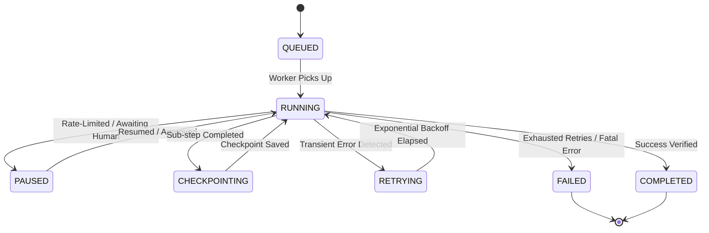

# 06 — TASK ENGINE SPECIFICATION

> **Document Version:** 0.1.0  
> **Status:** Approved Specification  
> **Component:** Task Lifecycle, Scheduling & Queue Engine (`@forge/task-engine`)  
> **Classification:** Core Engine Architecture

---

## 1. Overview & Terminology

The **Task Engine** is the deterministic work scheduler of Forge Wanzz. It converts conceptual actions requested by the Orchestration Engine into durable, queued, and idempotent execution units.

### Hierarchy:
- **Mission:** The top-level user goal (e.g. "Deploy staging environment").
- **Task:** A discrete, isolatable milestone assigned to an agent (e.g. "Generate Nginx configuration").
- **Step / Action:** An atomic tool invocation or reasoning loop turn within a task (e.g. `write_file('/etc/nginx.conf')`).

---

## 2. Task Lifecycle State Machine



### State Explanations:
- **`QUEUED`:** Task created, dependencies resolved, awaiting free worker thread.
- **`RUNNING`:** Actively leased by a worker; heartbeats are emitted every 2 seconds.
- **`PAUSED`:** Suspended intentionally for human approval or provider quota replenishment.
- **`CHECKPOINTING`:** Intermediate state dumped to disk (database) to guarantee zero loss on crash.
- **`RETRYING`:** Transient failure occurred (e.g. network timeout); waiting for backoff.
- **`COMPLETED` / `FAILED`:** Terminal states.

---

## 3. Queue Architecture & Concurrency Model

```
                    ┌──────────────────────────────┐
                    │      Priority Task Queue     │
                    │  (FIFO + Dynamic Priority)   │
                    └──────────────┬───────────────┘
                                   │
              ┌────────────────────┼────────────────────┐
              ▼                    ▼                    ▼
     ┌─────────────────┐  ┌─────────────────┐  ┌─────────────────┐
     │ Worker Slot #1  │  │ Worker Slot #2  │  │ Worker Slot #N  │
     │ (Max Concurrency│  │ (Max Concurrency│  │ (Max Concurrency│
     │   Config: 4)    │  │   Config: 4)    │  │   Config: 4)    │
     └─────────────────┘  └─────────────────┘  └─────────────────┘
```

### Concurrency Controls:
- **Global Concurrency Limit:** Configurable max parallel active tasks (default: 4 locally).
- **Per-Provider Concurrency:** Restricts parallel calls to sensitive rate-limited APIs (e.g. OpenAI tier limits).
- **Lease Lock Mechanism:** Tasks are locked with a 15-second lease. If a worker process dies without heartbeating, the lease expires and the task is automatically re-queued.

---

## 4. Checkpointing & Crash Resilience

To ensure long-running workflows survive machine restarts or process crashes:
1. **State Snapshotting:** At every step boundary, the Task Engine persists:
   - Current agent working memory and turn index.
   - Exact input/output variables of completed steps.
   - File hashes of created artifacts.
2. **Idempotency Keys:** Every task carries a unique deterministic SHA-256 hash based on `(mission_id + node_id + input_hash)`.
3. **Resume Command:** Running `forge resume <mission_id>` rehydrates the in-flight state without re-executing already verified idempotent nodes.

---

## 5. Task Definition Schema

```typescript
export interface TaskRecord {
  id: string;                    // UUID v4 or KSUID
  mission_id: string;            // Parent mission reference
  name: string;                  // Human-readable task name
  assigned_agent_id: string;     // e.g. "agent.engineer.coder"
  status: TaskStatus;            // QUEUED | RUNNING | COMPLETED | FAILED | PAUSED
  priority: number;              // 1 (Highest) to 100 (Lowest)
  idempotency_key: string;       // Unique deduplication hash
  dependencies: string[];        // Array of prerequisite Task IDs
  input_payload: Record<string, unknown>;
  output_payload?: Record<string, unknown>;
  retry_count: number;
  max_retries: number;
  timeout_ms: number;
  created_at: string;
  updated_at: string;
  heartbeat_at?: string;
}
```

---

## 6. Dead Letter Queue (DLQ) & Triage

Tasks that exceed `max_retries` are moved to the **Dead Letter Queue (DLQ)**.
- Detailed crash telemetry, stack traces, and the last 5 agent thoughts are logged.
- The operator can inspect the failed state via `forge dlq inspect <task_id>` and trigger manual retries with edited inputs.
